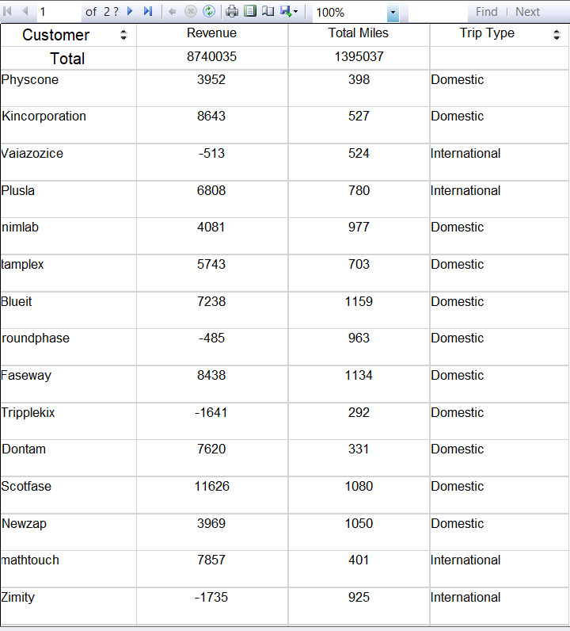
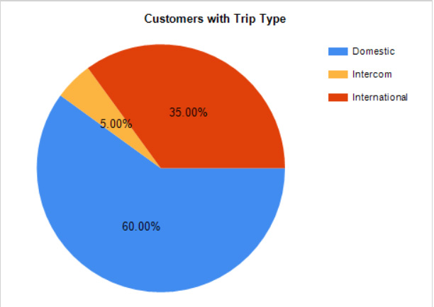
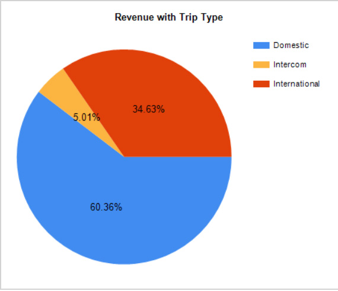
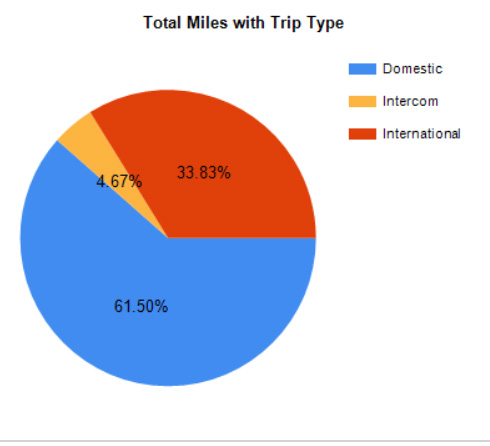

<html>
<head>
	
</head>
<body>
<h1 style="color: #5e9ca0; text-align: center;">Transport Data</h1>

This data is to show the Transport data of a particular company.

Company's Customers, Revenues the company got, Total Miles of transport and the trip type are given in the table below.

The trip types are categorized into Domestic, International and Intercom. Total Revenue and Miles travelled are also shown in the table.

&nbsp;

Most of the customers who used the service have opted for Domestic transport

&nbsp;

Since most of the customers opted for Domestic transport, the revenue company received is also through Domestic transport

&nbsp;

As a result, the majority trips for the company was Domestic.

&nbsp;

<h2 style="text-align: justify;"><strong>In sumamry, company gets revenue within the country. If any improvement if needed, they can concentrate on the trips International or Intercom.</strong></h2>
</body>
</html>
