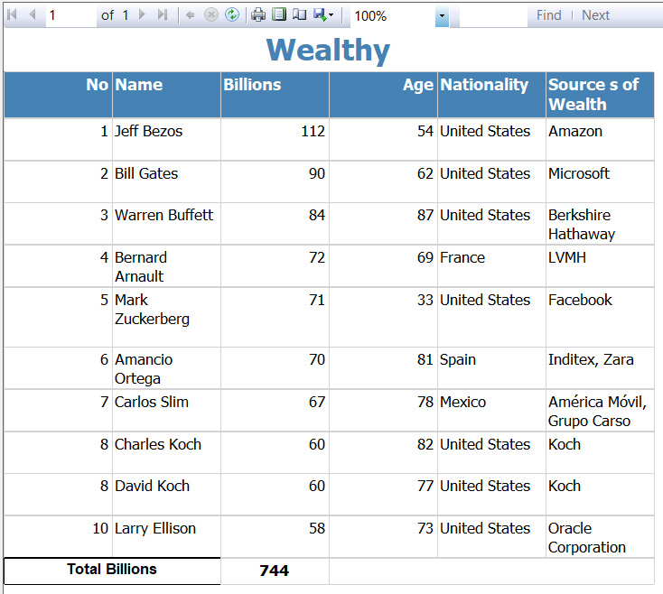
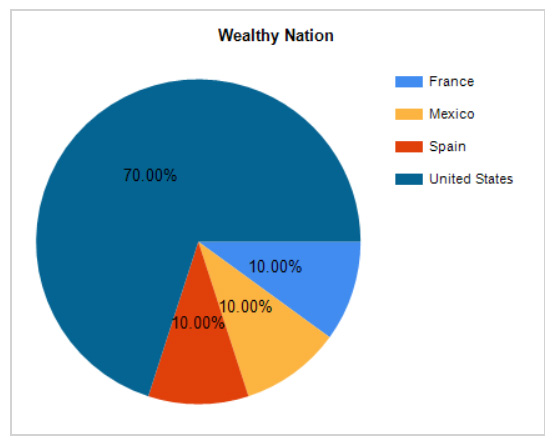

<html>
<body>
<h1 style="color: #5e9ca0;">Wealthy People Analysis</h1>

Analyse top 10 wealthy people and their nationality

The list of top 10 are in the table. Sum total of all of them are 744B.

If we check the nationality of top 10, and the percentage of wealth they own, 535B are from United States, more than half the total wealth. Almost 70%.

<h2>With almost 70%, United states have the majority top Billions in the world.</h2>
</body>
</html>
